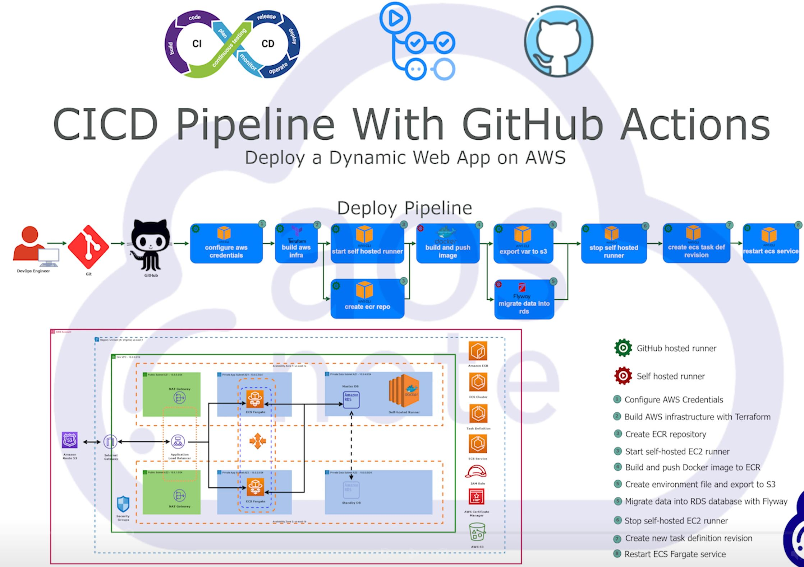

---
# Deploy Dynamic Web App on AWS using CI/CD Pipelines and GitHub Actions

This project demonstrates how to deploy a dynamic web application on AWS using EC2 servers and various AWS services. The deployment process is automated with CI/CD pipelines through GitHub Actions. The reference architecture diagram for this deployment is available in the GitHub repository.

## Prerequisites

- **AWS Account**
- **Terraform**
- **Visual Studio Code** (with Terraform extension)
- **GitHub Account**
- **AWS CLI**

## Setup Instructions

### 1. Install Prerequisites

1. **Install Terraform**  
   [Terraform Installation Guide](https://learn.hashicorp.com/tutorials/terraform/install-cli)

2. **Create a GitHub Account**  
   [GitHub Sign Up](https://github.com/join)

3. **Install Git**  
   [Git Installation Guide](https://git-scm.com/book/en/v2/Getting-Started-Installing-Git)

4. **Create SSH Key Pairs**  
   Add the public SSH key to your GitHub account.

5. **Install Visual Studio Code**  
   Install the Terraform extension in Visual Studio Code.

6. **AWS CLI Setup**  
   Install and configure the AWS CLI:
   ```bash
   aws configure --profile "profile_name"
   ```

### 2. AWS IAM User Setup

1. **Create IAM User**  
   In the AWS Management Console, create an IAM user and attach the necessary policies.

2. **Generate Access Keys**  
   Generate an access key and secret access key for the IAM user to allow programmatic access.

### 3. Terraform Setup

1. **Create a GitHub Repository**  
   Add a `.gitignore` template for Terraform, clone the repository to your computer, and update the `.gitignore` file as needed.

2. **Write Terraform Code**  
   Commit and sync your Terraform code changes.

3. **S3 Bucket for Terraform State**  
   Create an S3 bucket with a unique name and enable versioning.

4. **DynamoDB Table for State Locking**  
   Create a DynamoDB table with the name `terraform-state-lock` and a partition key `LockID`.

5. **Secrets in AWS Secrets Manager**  
   Store application secrets in Secrets Manager.

6. **Register Domain Name in Route 53**  
   Register a domain name using AWS Route 53.

7. **Update Terraform Backend File**  
   Update the `backend.tf` file with the S3 bucket and DynamoDB table information.

8. **Fill Out terraform.tfvars File**  
   Populate the `terraform.tfvars` file with the necessary variables, including VPC, RDS, ACM, S3, ECS, and Route 53 details.

9. **Test Terraform Code**  
   Validate and apply your Terraform code to provision the infrastructure.

### 4. GitHub Setup

1. **Create GitHub Personal Access Token**  
   Create a token with a 90-day expiration and select the `repo` scope.

2. **Add GitHub Repository Secrets**  
   Add the following secrets in GitHub repository settings:
   - `AWS_ACCESS_KEY_ID`
   - `AWS_SECRET_ACCESS_KEY`
   - `ECR_REGISTRY`
   - `PERSONAL_ACCESS_TOKEN`
   - `RDS_DB_NAME`
   - `RDS_DB_PASSWORD`
   - `RDS_DB_USERNAME`

### 5. GitHub Actions Workflow

1. **Create Workflow File**  
   Create a `.github/workflows/deploy_pipeline.yml` file.

2. **Configure AWS Credentials**  
   Use the `aws-actions/configure-aws-credentials` action in the workflow.

3. **Deploy AWS Infrastructure**  
   Use the `hashicorp/setup-terraform@v3` action to deploy the infrastructure.

4. **Create Amazon ECR Repository**  
   Use the `aws-actions/amazon-ecr-login@v1` action to create and login to ECR.

5. **Set Up a Self-Hosted Runner**
   1. Launch an Amazon Linux 2023 EC2 instance.
   2. SSH into the instance and install Docker and Git.
   3. Create an AMI from this instance and terminate it.

6. **Start Self-Hosted Runner**  
   Use the `machulav/ec2-github-runner` action to start the runner.

7. **Build and Push Docker Image to ECR**  
   Add environment variables and use the `aws-actions/amazon-ecr-login@v1` action to push the Docker image.

8. **Export Environment Variables to S3**  
   Export environment variables to the S3 bucket for ECS use.

9. **Migrate Data into RDS Database**  
   Use Flyway to migrate the database.

10. **Stop Self-Hosted Runner**  
    Terminate the self-hosted runner in the AWS Management Console.

11. **Create ECS Task Definition Revision**  
    Update the ECS task definition with the new Docker image.

12. **Restart ECS Fargate Service**  
    Restart the ECS Fargate service to deploy the new version.

## Conclusion

This project demonstrates a full CI/CD pipeline for deploying a dynamic web app on AWS using Terraform, GitHub Actions, and various AWS services. By following these steps, you can automate the deployment process and ensure a scalable and secure infrastructure for your application.

---
